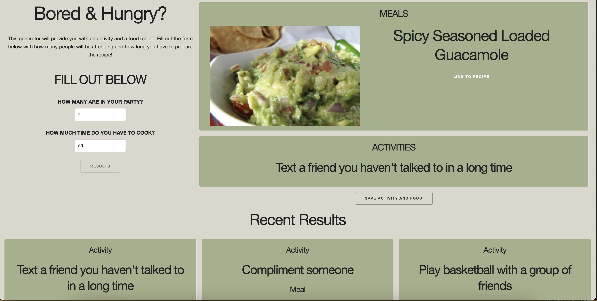
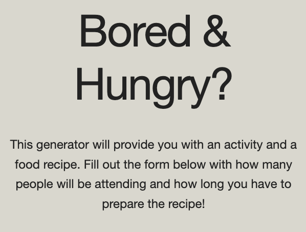
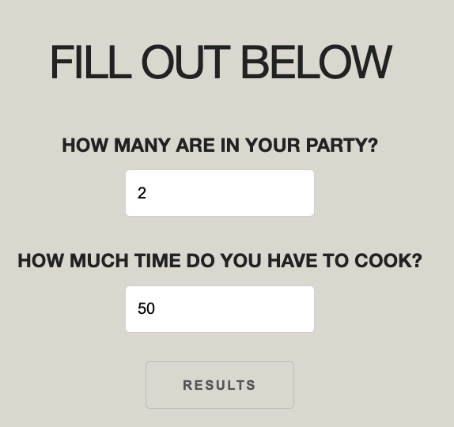
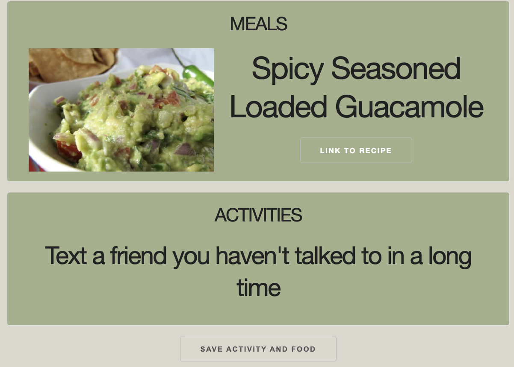

# bored-and-hungry

## Description

 
    We created a generator that provides users with an activity to do and a recipe to make. Insert a number from 1-5 for people in your party and a preparation time and it will generate one for you!

## Technologies
<ul>
    <li> HTML
    <li> CSS
    <li> JavaScript
    <li> Skeleton
    <li> JQuery
    <li> API
</ul>

## Screenshots

## Links

[Bored and Hungry]()

## Collaborators 
- [Lisette Gonzalez](https://github.com/lissygonz)
- [Rodolfo Cabrera](https://github.com/rodolfopoly)
- [Brian Hernandez](https://github.com/HdezB)
- [Megan Silva](https://github.com/megansilva) 
